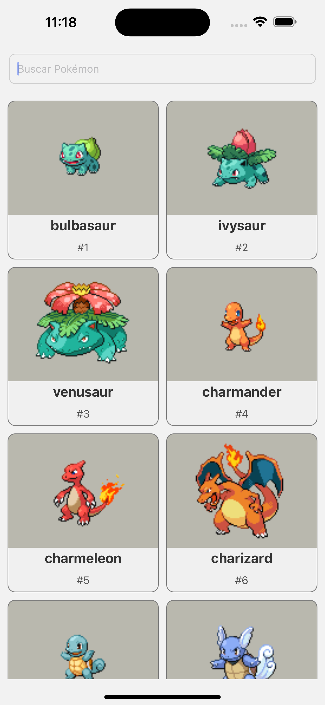
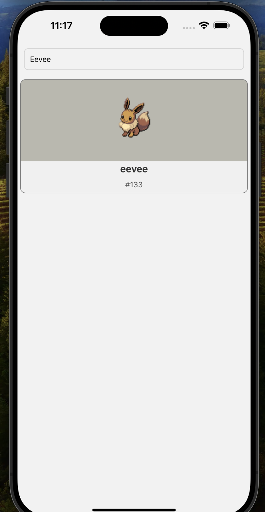
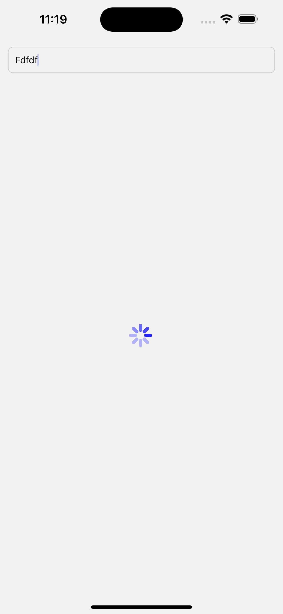
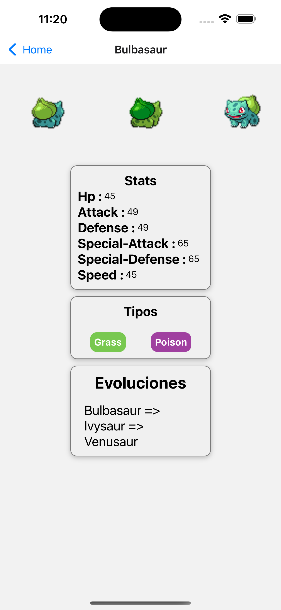
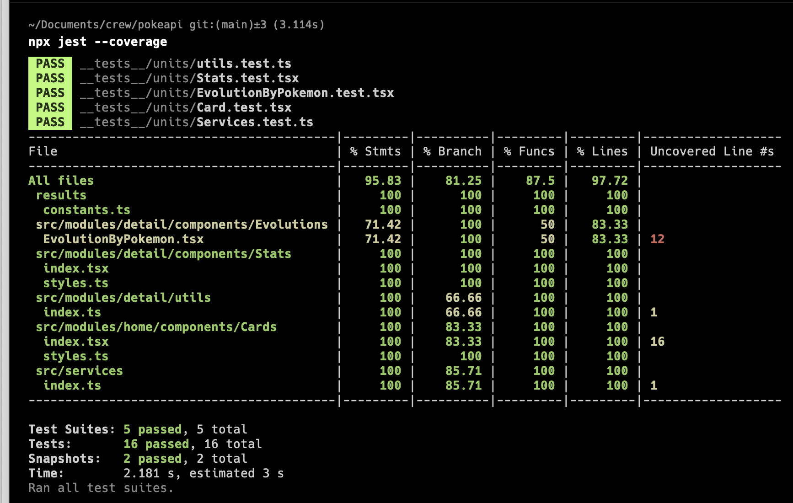

## Poke Search App

Esta es una prueba utilizando diferentes tecnologías a nivel de app mobile y usando como API [PokeApi](http://pokeapi.co)

### Tecnologias
- NodeJS 20
- React Native 0.73.4

### Instalacion
Para poder correr este proyecto tienes que tener previamente instalado react native con todas las dependencias necesarias. 
[Doc installation React Native](https://reactnative.dev/docs/environment-setup)

### Run

- Npm install
- npm run start

## Views

#### Pantalla Principal

### Pantalla de busqueda

### Pantalla no encontrado

### Pantalla detalle Pokemon

### TEST

